# Operating System Hardening (Server)

## Security profile configuration  

The CIS Benchmark 2.0 for Redhat Enterprise Linux 9 will be used as a reference point to implement the relevant configurations for hardening the Operating System of the virtual machine. Each Benchmark represents a series of security recommendations created by a community of IT professionals with the aim of hardening organizations against cyberattacks (_CIS Benchmarks_, n.d.).

The benchmarks from CIS align with popular frameworks such as the NIST Cybersecurity Framework, HIPAA, PCI-DSS, and the ISO 27000 family (Dharap, n.d.)

To implement the security profile, the following steps will be taken:

- Root user: It is advisable to use it only as a last resort when necessary; some tools behave unexpectedly if we only use sudo.

Be careful with how sudo is used:  
- sudo -i ≈ log in as root (similar to su -). (Most recommended option)  
- sudo command runs only that command as root.  
- sudo -i starts an interactive shell as root.  

Apply the principle of least privilege (PoLP) is a security concept that states that a user, application, or system should only have access to the resources and permissions it needs to perform its specific task, and nothing more. In other words, the lowest possible level of access is granted to minimize risk in case of a security breach. 

### Password policies
Due to the access and control that root and administrator accounts have, it is necessary to establish policies to regulate and maintain an acceptable level of protection for each one. Within the benchmark document, section 5.3.3.1 "Configure pam_faillock module" is relevant, where regulations can be found regarding the maximum number of failed authentication attempts, minimum password length, and other considerations for a password to be "strong".


### Profile deployment
To configure the selected security profile, OpenSCAP will be used, a tool that allows analyzing the current configuration and searching for possible vulnerabilities within the system.

First, we need to install the necessary packages:
```sh
yum install openscap-scanner scap-security-guide
```

Next, we can use the info command to examine the contents of the file that contains the profiles we can use
```sh
oscap info /usr/share/xml/scap/ssg/content/ssg-rl9-ds.xml
```

This is the output of the command:


In this case, the profile with the id ``xccdf_org.ssgproject.content_profile_cis_server_l1`` is the one we will use. To apply the scan and simultaneously generate a file with the scripts necessary to apply the rules:

```sh
oscap xccdf generate fix --profile xccdf_org.ssgproject.content_profile_cis_server_l1 /usr/share/xml/scap/ssg/content/ssg-rl9-ds.xml > remediate.sh
```

We can see the contents of the generated script with `vi`:

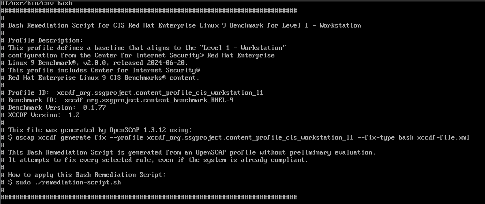

The old permissions must be changed (with chmod) so that it can be executed, after this it is possible that some account is deactivated for having an insecure password, if access to the system is completely lost the system must be rescued.

```sh
chmod +x remediate.sh
```

### Losing access to the system

It is possible that when we run the script with the fixes, the passwords of the active accounts on the machine expire, this happens

#### System Recovery
In case the configurations were applied with openscap and access to the system is accidentally lost (disabled accounts).
This is part of section *5.4.1.1 Ensure password expiration is configured (Automated)* where a maximum time for a password is configured after which it is disabled.

The purpose is **to prevent an attacker from accessing with compromised credentials**, it is recommended to set this period to 365 days or less, with the consideration that very repetitive changes may result in users using predictable or sequential passwords.

The lockout occurs because, when setting a password in the initial system setup, the `last change date field` is not set and any value of the `PASS_MAX_DAYS` parameter will cause the password to expire immediately. One possible solution is to fill the field with a command like:
```sh
chage -d "$(date +%Y-%m-%d)" root
```

However, for the purposes of the project, this function will be disabled. This can be done by excluding the rule from the script when generating it, or manually changing the parameter from the auto-generated script:

```SH
###############################################################################
# BEGIN fix (59 / 278) for 'xccdf_org.ssgproject.content_rule_accounts_maximum_age_login_defs'
###############################################################################

(>&2 echo "Remediating rule 59/278: 'xccdf_org.ssgproject.content_rule_accounts_maximum_age_login_defs'"); (

# Remediation is applicable only in certain platforms
if rpm --quiet -q shadow-utils; then
var_accounts_maximum_age_login_defs='-1' # <- FIJAR A -1

...

###############################################################################
# BEGIN fix (60 / 278) for 'xccdf_org.ssgproject.content_rule_accounts_password_set_max_life_existing'
###############################################################################

(>&2 echo "Remediating rule 60/278: 'xccdf_org.ssgproject.content_rule_accounts_password_set_max_life_existing'"); (
var_accounts_maximum_age_login_defs='-1' # <- FIJAR A -1
```

Once in the GRUB menu (where the boot options are listed), select the system entry and press ``e`` to edit it. It will look something like this:

```sh
setparams 'Rocky Linux (5.14.0-427.13.1.el9_4.x86_64) 9.6 (Blue Onyx)'

load_video
set gfx_payload=keep
insmod gzio
insmod part_msdos
insmod xfs
set root='hd0,msdos1'
if [ x$feature_platform_search_hint = xy ]; then
  search --no-floppy --fs-uuid --set=root --hint-bios=hd0,msdos1 12345678-abcd-1234-5678-123456789abc
else
  search --no-floppy --fs-uuid --set=root 12345678-abcd-1234-5678-123456789abc
fi
linux /vmlinuz-5.14.0-427.13.1.el9_4.x86_64 root=/dev/mapper/rl-root ro crashkernel=1G-4G:192M,4G-64G:256M,64G-:512M resume=/dev/mapper/rl-swap rd.lvm.lv=rl/root rd.lvm.lv=rl/swap rhgb quiet
initrd /initramfs-5.14.0-427.13.1.el9_4.x86_64.img
```

Go to the line that starts with ``linux`` and edit it to include the following at the end

```sh
systemd.unit=emergency.target

# Opciones alternas:
# systemd.unit=rescue.target
# Iniciar directamente en consola
# init=/bin/bash
```

Press Ctrl+X to boot with these changes or press F10 (the changes will be temporary)

Once the system has started, log in as root and execute the following in the console:

```sh
# Remontar root dir en modo rw
mount -o remount,rw /

# Reiniciar contraseñas
passwd root

# Reiniciar
reboot
```

Finally, restore the passwords with `passwd <user>` and reboot the system.

### Verification of applied changes

To verify that the changes were applied correctly, the openscap tool can be run again and the analysis result can be saved in a document, in this case, the results will be saved in html for easier visualization but they can also be saved in an xml document and viewed locally with vi.

```sh
oscap xccdf eval --profile xccdf_org.ssgproject.content_profile_cis_workstation_l1 --report cr.html /usr/share/xml/scap/ssg/content/ssg-rl9-ds.xml
```

Using an scp client, the file can be shared via ssh if we know the ip of the vm, this can be obtained with ip addr, then we can open the file in a browser.

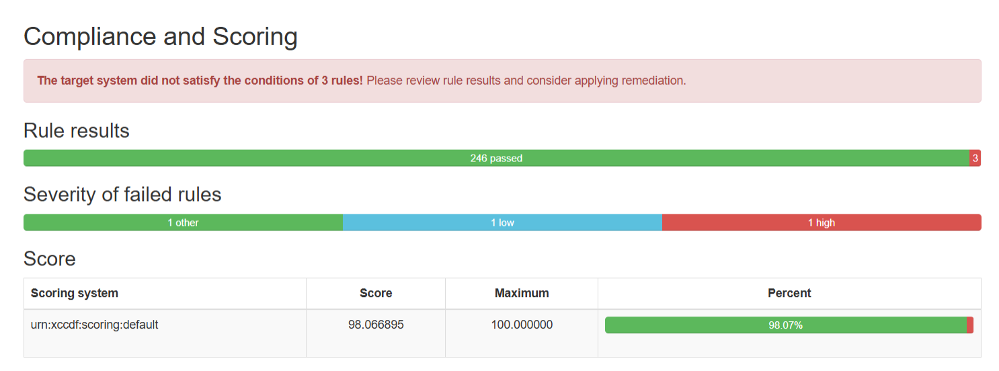

The report indicates that 3 rules of the profile have not been met, you can navigate to each of these to find a script that solves the problem or find the specific cause at least.

### Manual fixes
Several rules are not met, for example:

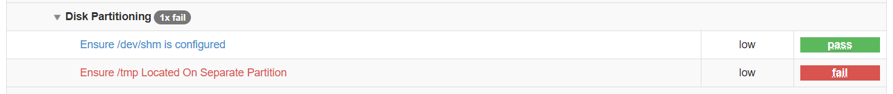

The purpose is to make ``/tmp`` have its own file system in order to be able to configure additional mount options such as noexec and thus eliminate the possibility of code being executed there and therefore discourage attackers who try to install executable programs in this part of the system.
 
First `/etc/fstab` must be edited to add the following line at the end of the file:
```sh
mount -t tmpfs -o size=25% tmpfs /tmp
```

After that, the `/etc/fstab` file must be edited so that the configuration persists across reboots.

```sh
tmpfs 0 /tmp tmpfs defaults,rw,nosuid,nodev,noexec,relatime,size=25% 0 
```

After this, other rules are no longer met due to the recent changes:

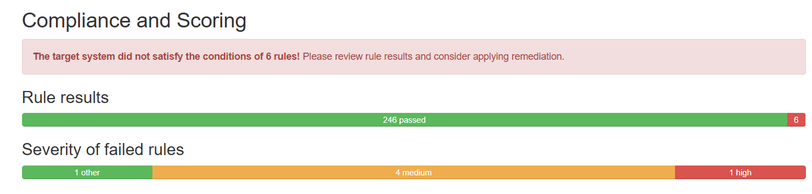

Before, there were 2 rules not met but now there are 6, however, the rule of placing /tmp in another partition is already met:


The previous steps can be repeated to regenerate a script with the necessary fixes and execute it again.

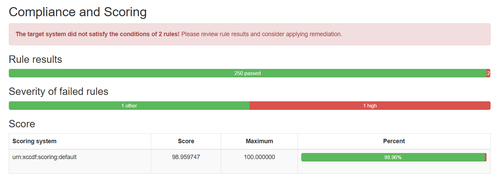

The remaining rules are related to limiting SSH access:


This one can be ignored because it has been dropped from the recommendation list in the latest versions of the benchmark.

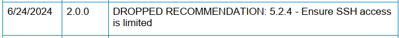

Source: _Checklist CIS_ _Red Hat Enterprise Linux 9_ _Benchmark,_ _p 1076_

Next, configuring a grub password can prevent unauthorized users from altering boot parameters or changing boot partitions.


To set a password for grub2, the following command is executed:
```sh
grub2-setpassword
```

After this, we enter the password that we will use in grub2. After executing the command, the oscap report indicates that there are no more rules to comply with.

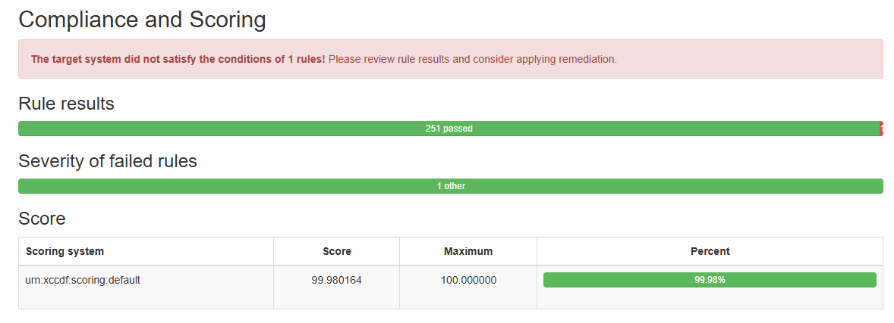

As a final step in this section, the state of SELinux will be changed to enforcing, which is responsible for enforcing the necessary security policies:

```sh
vi /etc/selinux/config
```

This is the default content of the file:

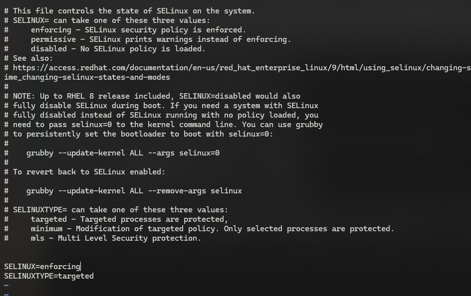


En resumen, entre las configuraciones aplicadas:

In summary, among the applied configurations:

- **SSH**: It has been disabled for the Root account, access with empty passwords has been disabled, host-based authentication has been disabled, etc.
- **Particiones**: Se coloco /tmp en una partición separada.
- **Partitions**: /tmp was placed in a separate partition.
- **Access to accounts**: PAM was enabled and will be used to maintain control over password requirements for users and root, it was also verified that all files belong to a user and that there is no file with global write permissions.
- **GRUB**: A password was set for the bootloader.
- **SELinux**: The libselinux package was installed and its state was configured to enforcing.

## Package updates
Keeping our OS and the software we have installed on it up to date is very useful for obtaining improvements in security, integrity, compatibility, and system performance (Worthington, 2024). This process can be done automatically and manually. First, we will manually execute this step to have greater control and supervise the packages that are being updated before applying changes to the system.

To obtain available updates:
```sh
dnf check-update
```

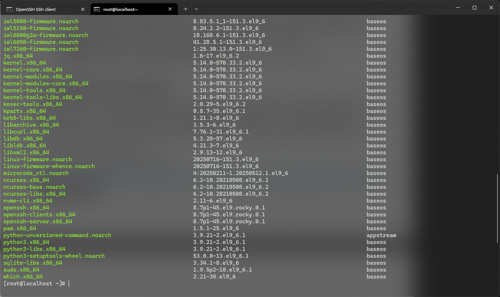

As a result, we can see quite a few packages that need to be updated including curl, openssh, sudo, etc. Now to update the packages whose updates include security fixes:

```sh
dnf upgrade --security
```
Now for the other reasons mentioned above, the following command can be executed to update packages to the latest available version that provides a bugfix, improvement, or security fix (_Dnf(8) - Linux Manual Page_, n.d.):

```sh
dnf upgrade-minimal
```

However, in this case, there are no packages to update:

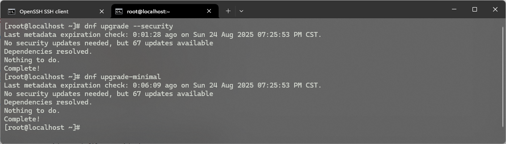

In summary, no updates are strictly necessary.

### Automatic updates with dnf-automatic
We can automatically manage security updates with dnf-automatic, we first need to install the package:

```sh
dnf install dnf-automatic
```
Now it is recommended to edit the service configuration to enable updates related only to security:

```sh
vi /etc/dnf/automatic.conf
```

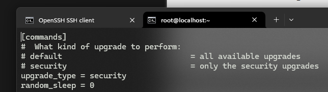

The update type must be changed to security to prevent updates that compromise system integrity (Worthington, 2024).

Now we can enable the timer that will run the service automatically:

```sh
systemctl enable dnf-automatic-install.timer
```

This will make the service run daily and check for security updates, applying them automatically if available.

## Additional SSH hardening
The SSH protocol uses public key cryptography to authenticate hosts and users (SSH Academy, 2025), we can generate these keys to facilitate access to our server via SSH.

To generate a key from the client:

```sh
ssh-keygen -t ed25519 -f /.ssh/<nombre_de_llave>
```

It is worth noting that the ed25519 algorithm is recent and support in clients is not yet universally adopted. (SSH Academy, 2025). Now we can use the generated key with the virtual machine as follows:

```sh
mkdir -p ~/.ssh
chmod 700 ~/.ssh
```

We create the .ssh directory under an administrator user, in this case _ebai_. Then we add the public key to the file with the authorized keys:

```sh
vi ~/.ssh/authorized_keys
chmod 600 ~/.ssh/authorized_keys 
```

In the file we must paste the contents of the public key that was generated earlier, in my case it is located at C:\Users\Esteban\.ssh\ebai-vm-rocky.pub it is important **not to add line breaks** and **verify that the key was copied correctly**. In addition, it must be verified that in the ssh configuration in /etc/ssh/sshd_config the following fields are configured as follows:

```
PubkeyAuthentication yes
AuthorizedKeysFile .ssh/authorized_keys 
```

If any changes were made to the sshd_config file, the ssh service must be restarted:

```sh
systemctl restart sshd 
```

Finally, it must be verified that the directories belong to the correct group (_ebai_ in this case) and not root since ssh access to this account was disabled, we can verify this with:

```sh
ls -la ~/.ssh/
```

### Fail2ban configuration

Due to the level of access that can be obtained with SSH as well as its ubiquity in most servers accessible via the Internet, it is common to consider services in charge of this protocol as a very predictable attack surface through which an attacker can gain access (Garnett, 2022).

To protect the SSH service of our OS, we can use Fail2ban to mitigate the effectiveness of brute force attacks, it is responsible for creating rules that modify the firewall configuration to block specific IPs. To install Fail2ban we must add the Enhanced Packages for Enterprise Linux (EPEL) repository since it is not available in the default repositories:

```sh
dnf install epel-release -y 
dnf install fail2ban
```

Now we can configure the service by copying the default configuration file to a new file called `jail.local`:

```sh
cp /etc/fail2ban/jail.conf jail.local
vi /etc/fail2ban/jail.local
```

To configure the specific profile for ssh:

```
[sshd]
# To use more aggressive sshd modes set filter parameter "mode" in jail.local:
# normal (default), ddos, extra or aggressive (combines all).
# See "tests/files/logs/sshd" or "filter.d/sshd.conf" for usage example and details.
#mode   = normal
enabled = true  # AGREGAR ESTO
port    = ssh
logpath = %(sshd_log)s
backend = %(sshd_backend)s
```


The following parameters can be changed such as maximum allowed attempts, ban time, etc:

```
maxretry = 5
bantime.factor = 2 # Duplicar tiempo de ban después de cada bloqueo
bantime = 10m
```

To activate the service and configure it to start automatically:

```sh
systemctl enable fail2ban 
systemctl start fail2ban 
```

To test the service, you can try to log in with incorrect passwords and then check the timeout when trying to connect again (in this test case maxretry = 3 was configured):


## Firewall configuration with firewalld

Firewalld will be used given the ease it provides in managing firewall rules for different types of configurations. For now, only incoming SSH traffic will be allowed. First, the public zone is configured as the default:

```sh
firewall-cmd --set-default-zone=public
```

Then the services that are in this zone must be removed, to find them:

```sh
firewall-cmd --list-services
```


Cockpit is a remote management service that allows connecting over the network to a GUI interface and managing the server remotely, while the dhcpv6-client is a service responsible for obtaining IPv6 network parameters from a DHCP server. Neither of these services are needed at the moment so they can be disabled:

```sh
firewall-cmd --zone=public --remove-service=cockpit
firewall-cmd --zone=public --remove-service=dhcpv6-client
```

To save the changes made to the firewall configuration so that they persist after a reboot:

```sh
firewall-cmd --runtime-to-permanent
```

## Bibliography
- _NCP - Checklist CIS_ _Red Hat Enterprise Linux 9_ _Benchmark_. (n.d.). https://ncp.nist.gov/checklist/1072
- UMATechnology. (2025, July 6). _Using VMware Workstation disk utilities to increase disk space and add new disks - UMA Technology_. UMA Technology. https://umatechnology.org/using-vmware-workstation-disk-utilities-to-increase-disk-space-and-add-new-disks/
- Broadcom. (2025, July 21). _Understanding common networking configurations_. https://techdocs.broadcom.com/us/en/vmware-cis/desktop-hypervisors/workstation-pro/17-0/using-vmware-workstation-pro/configuring-network-connections/understanding-common-networking-configurations.html
- _CIS Benchmarks_. (n.d.). CIS. https://www.cisecurity.org/cis-benchmarks-overview
- Dharap, A. (n.d.). _Applying CIS benchmarks to your Linux OS with hardened images_. OpenLogic. https://www.openlogic.com/blog/cis-benchmarks-linux-hardening
- Couch, T. (2024, October 19). _Automated security hardening on RockyLinux with OpenSCAP_. Tech Couch. https://tech-couch.com/post/automated-security-hardening-on-rockylinux-with-openscap
- _OpenSCAP User Manual_. (n.d.). [https://static.open-scap.org/openscap-1.2/oscap_user_manual.html#_introduction](https://static.open-scap.org/openscap-1.2/oscap_user_manual.html#_introduction)
- Worthington, D. (2024, January 11). _How to keep Rocky Linux up to date_. JumpCloud. https://jumpcloud.com/blog/how-to-keep-rocky-linux-up-to-date#:~:text=In%20order%20to%20check%20available,upgrade%20version%20of%20existing%20packages).
- _dnf(8) - Linux manual page_. (n.d.). https://man7.org/linux/man-pages/man8/dnf.8.html
- SSH Academy. (2025, March 7). Detailed Description of How to Configure Authorized Keys for OpenSSH. _SSH Academy_. https://www.ssh.com/academy/ssh/authorized-keys-openssh#generating-new-keys
- Garnett, A. (2022, July 5). _How To Protect SSH with Fail2Ban on Rocky Linux 8_. DigitalOcean. https://www.digitalocean.com/community/tutorials/how-to-protect-ssh-with-fail2ban-on-rocky-linux-8