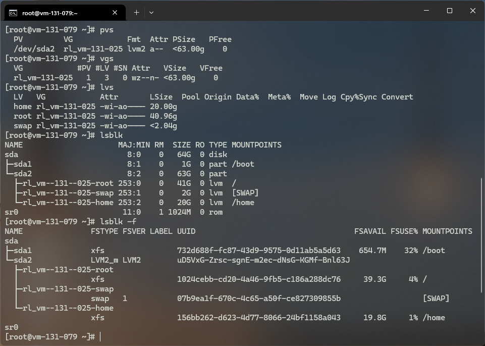
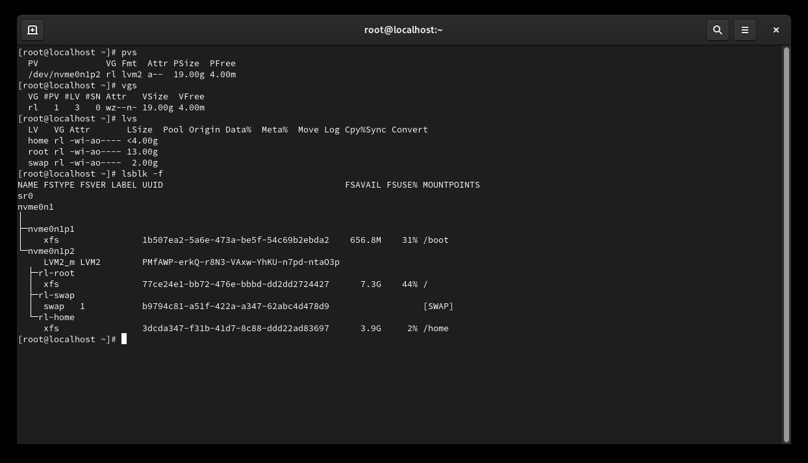

# Setting up the VM

The hardening process specified in this repo has a specific target in mind, a single Rocky Linux 9.3 VM running in the NAC (Nube Academica Institucional).

In order to make this process as close to the real infrastructure as possible, the following steps were taken to re-create a VM with similar characteristics.

## Creating the VM
We can configure a VM in VMWare Workstation or VirtualBox to use LVM with the GUI setup program. As reference these are the necessary physical volumes, volume groups and logical volumes:



After setting up the language, keyboard, and network, we can proceed to the disk configuration, for this we can use the "Custom" option inside the disk configuration menu:


We will use LVM with the following layout:


- `/boot`: 1 GB as a standard partition.
- `swap`: 2 GB as an LVM logical volume with xfs.
- `/`: 13 GB as an LVM logical volume with xfs.
- `/home`: 4 GB as an LVM logical volume with xfs.

It is important to set `/boot` as a standard partition, otherwise the bootloader won't be able to find the kernel. Since the kernel is needed to apply LVM mappings, this would lead to an unbootable system.

This is the final layout of the VM once the installation is complete:



The biggest difference is the size of the `/` and `/home` partitions, which can be adjusted later if needed.

## Virtual Machine Specifications

The following are the specifications of the VM used for testing:
- OS: Rocky Linux 9.3 (Server with GUI)
- CPU: 2 vCPUs
- RAM: 4 GB
- Disk: 20 GB

### NAC VM Specifications

The target VM in the NAC has the following specifications:

- OS: Rocky Linux 9.3 (Server without GUI)
- CPU: 2 vCPUs
- RAM: 6 GB
- Disk: 64 GB


All of this has been verifies with the following commands:

#### Disk Layout
```sh
[root@vm-131-079 ~]# fdisk -l
Disk /dev/sda: 64 GiB, 68719476736 bytes, 134217728 sectors
Disk model: Virtual disk
Units: sectors of 1 * 512 = 512 bytes
Sector size (logical/physical): 512 bytes / 512 bytes
I/O size (minimum/optimal): 512 bytes / 512 bytes
Disklabel type: dos
Disk identifier: 0xcc709fff

Device     Boot   Start       End   Sectors Size Id Type
/dev/sda1  *       2048   2099199   2097152   1G 83 Linux
/dev/sda2       2099200 134217727 132118528  63G 8e Linux LVM
```

#### Memory
```sh
[root@vm-131-079 ~]# free -h
total        used        free      shared  buff/cache   available
Mem:           5.5Gi       520Mi       4.9Gi       107Mi       466Mi       5.0Gi
Swap:          2.0Gi          0B       2.0Gi
```

#### Users
```sh
[root@vm-131-079 ~]# cat /etc/passwd
root:x:0:0:root:/root:/bin/bash
bin:x:1:1:bin:/bin:/sbin/nologin
........
uadmin:x:1000:1000:Administrador UNAC:/home/uadmin:/bin/bash
ci0143:x:1001:1002:System Admin:/home/ci0143:/bin/bash
```


```sh
[root@vm-131-079 ~]# cat /etc/rocky-release
Rocky Linux release 9.3 (Blue Onyx)
```
