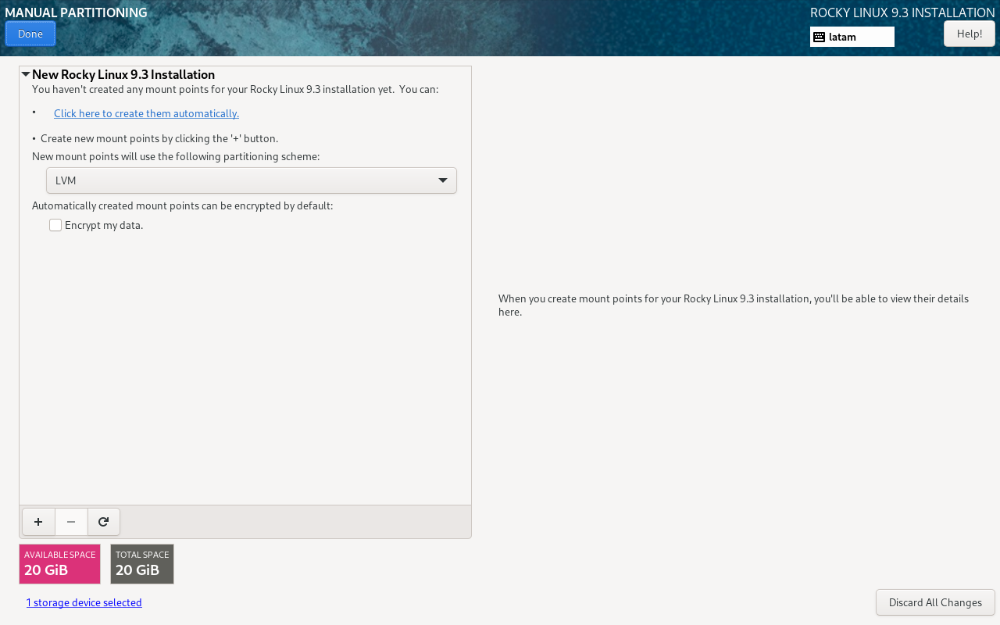
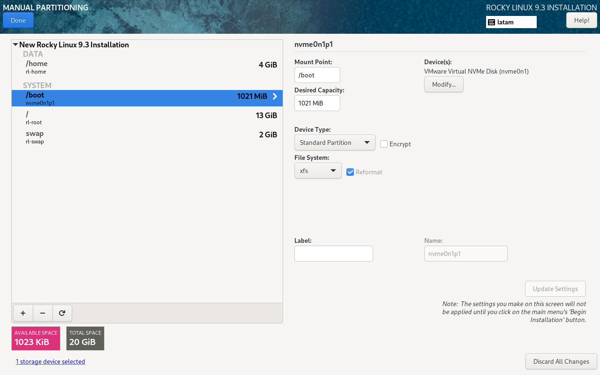

# Setting up the VM

The hardening process specified in this repo has a specific target in mind, a single Rocky Linux 9.3 VM running in the NAC (Nube Academica Institucional).

In order to make this process as close to the real infrastructure as possible, the following steps were taken to re-create a VM with similar characteristics.

## Creating the VM
We can configure a VM in VMWare Workstation or VirtualBox to use LVM with the GUI setup program. As reference these are the necessary physical volumes, volume groups and logical volumes:

After setting up the language, keyboard, and network, we can proceed to the disk configuration, for this we can use the "Custom" option inside the disk configuration menu:

We will use LVM with the following layout:

- `/boot`: 1 GB as a standard partition.
- `swap`: 2 GB as an LVM logical volume with xfs.
- `/`: 13 GB as an LVM logical volume with xfs.
- `/home`: 4 GB as an LVM logical volume with xfs.

It is important to set `/boot` as a standard partition, otherwise the bootloader won't be able to find the kernel. Since the kernel is needed to apply LVM mappings, this would lead to an unbootable system.

This is the final layout of the VM once the installation is complete:

The biggest difference is the size of the `/` and `/home` partitions, which can be adjusted later if needed.